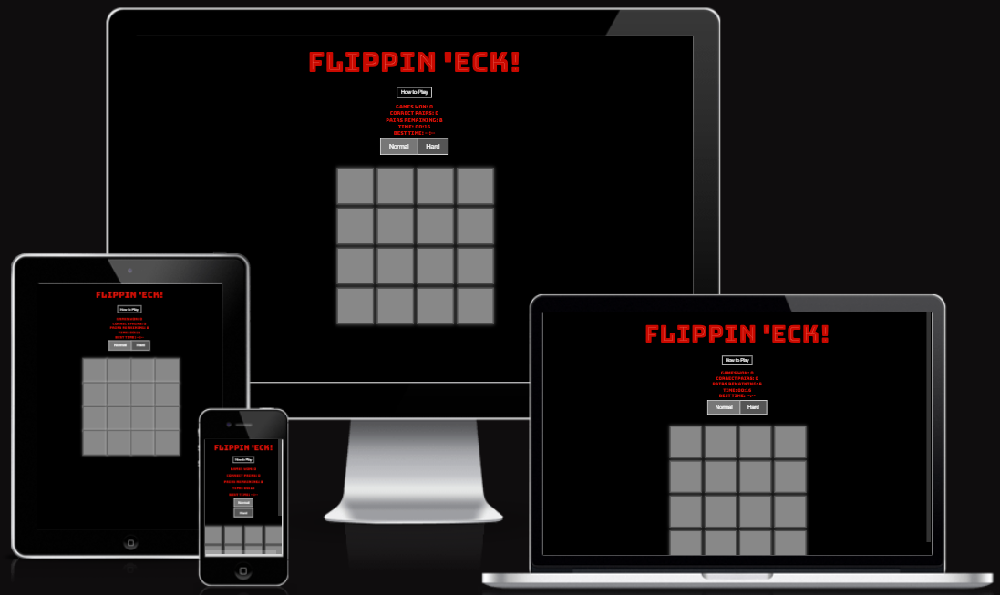
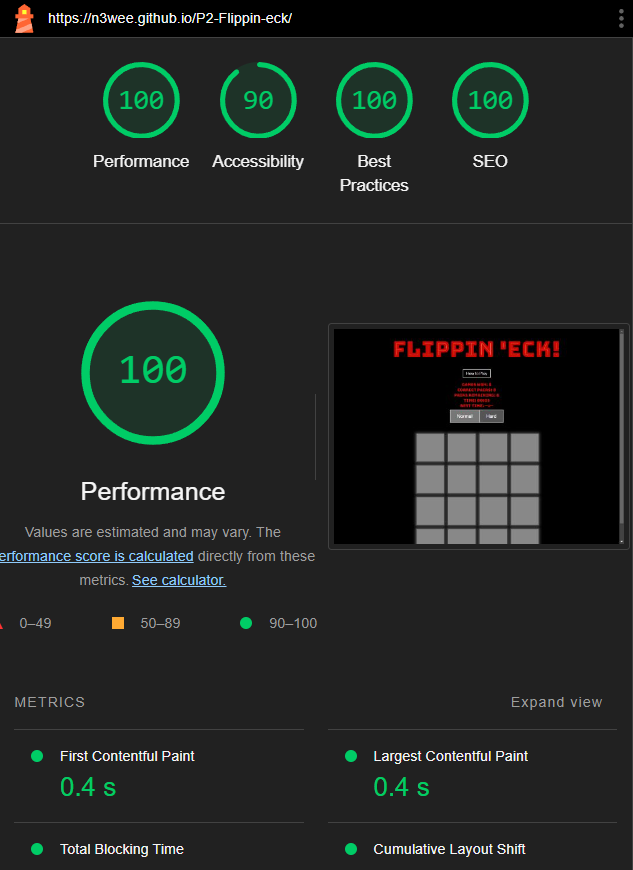
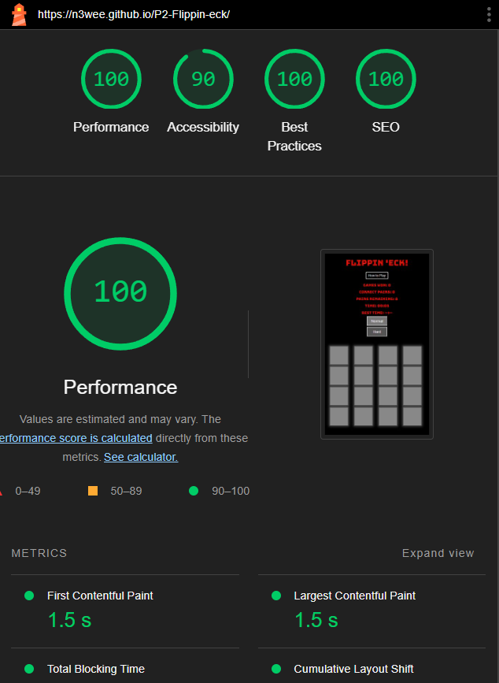

# Flippin 'Eck!

## Overview
Welcome to **Flippin 'Eck!**, a memory card matching game that challenges players to find all matching pairs within a grid. This project allows players to select between two difficulty modes, track their progress with various statistics, and compete against their best times.

The game is responsive, ensuring an enjoyable experience across different devices, including desktops, tablets, and mobile phones.

## Features

### Game Modes
- **Normal Mode (4x4 Grid)**: A standard difficulty level with 16 cards.
- **Hard Mode (6x6 Grid)**: An advanced difficulty level with 36 cards.

### Game Stats
- **Games Won**: Tracks the number of games won in the current session.
- **Correct Pairs**: Displays the number of correct pairs found in the current game.
- **Pairs Remaining**: Shows how many pairs are left to be found.
- **Timer**: Counts the time taken to complete the game.
- **Best Time**: Displays the best time achieved for the selected difficulty mode.

### How to Play
- A "How to Play" button reveals instructions to guide new players on how to play the game.

### Responsive Design
- The game adapts to different screen sizes, ensuring a smooth experience on mobile devices, tablets, and desktops.

## Key Functions

### Shuffle Function
The `shuffle` function randomly shuffles an array of cards. This function is based on the widely-used Fisher-Yates (Knuth) Shuffle algorithm.

## Game Initialization
The `startGame` function initializes the game, setting up the grid based on the selected difficulty mode, shuffling the cards, and resetting the game stats.

## Card Matching Logic
The game employs a simple card matching logic where two cards are flipped and checked for a match. If they match, they remain visible; if not, they are flipped back.

## Timer Functionality
The `updateTimer` function keeps track of the time elapsed during the game and displays it in `mm:ss` format.

## Best Time Tracking
The best time for each difficulty mode is stored in the browser's `localStorage`. When a new best time is achieved, it is saved and displayed.

## Testing

### Cross-Browser Testing
The game was tested across multiple browsers, including Chrome, Firefox, Safari, and Edge, to ensure compatibility and consistent performance.

### Responsive Design Testing
The game's layout and functionality were tested on various screen sizes to ensure that it works seamlessly on desktops, tablets, and mobile devices.

### Game Logic Testing
The game logic, including the card matching, timer, and best time tracking, was rigorously tested to ensure accuracy and a smooth user experience.

### Lighthouse Testing
Lighthouse tests were conducted for both desktop and mobile versions of the site.

#### Desktop Results
The results for desktop showed excellent performance across all metrics.

#### Mobile Results
The mobile test results indicated good performance overall, with some areas for future improvement in terms of performance.

## Deployment
The game was deployed using GitHub Pages. The steps for deployment are as follows:

1. Push the code to a GitHub repository.
2. In the repository, go to the "Settings" tab.
3. Under the "Pages" section, select the branch to deploy from (usually `main` or `master`).
4. Save the settings, and the game will be live at the URL provided by GitHub Pages.

## Credits

### Content
All game logic and written content were created by the developer.

### Code
The base code structure and design elements were developed by the developer with guidance from the developer's module instructions and GPT-4.

### Media
No external media was used in this project, except for the Google Fonts integration for the Bungee Tint font.
